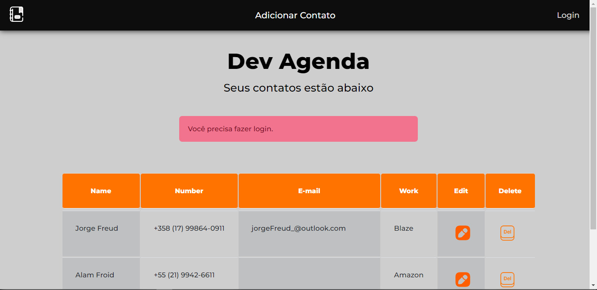

<h1 align="center">📙DEV AGENDA📙</h1>

    

## 🚀 Tecnologias

Esse projeto foi desenvolvido com as seguintes tecnologias:

- EJS e CSS
- JavaScript
- Git e Github
- NodeJS
- Json
- Bibliotecas (Express, nodemon, webpack, bcryptjs, validator, helmet, csrf, babel)
- MongoDB
- Google Cloud

## 💻 Projeto

Projeto de cadastro de contatos em sua agenda privada, com sistema de login e registro, cadastro de contatos, edição e delete de contatos. Condição de estar logado e registrado no sistema para a realização do cadastro de novos usuários. Utilizando as ferramentas e conhecimentos do curso de JS do Luiz Otávio Miranda na Udemy.

- [Acesse o projeto finalizado, online](gabrielfreitasc.github.io/DevExperience/)

## 🔑 Inicialização do Projeto
    
    Inicie o projeto no terminal: npm start
    Inicie o webpack (configurações do css): npm run dev

---

Feito com ❤ by Gabriel Freitas - Siga-me no [Linkedin](https://www.linkedin.com/in/gabriel-freitasdev/)
